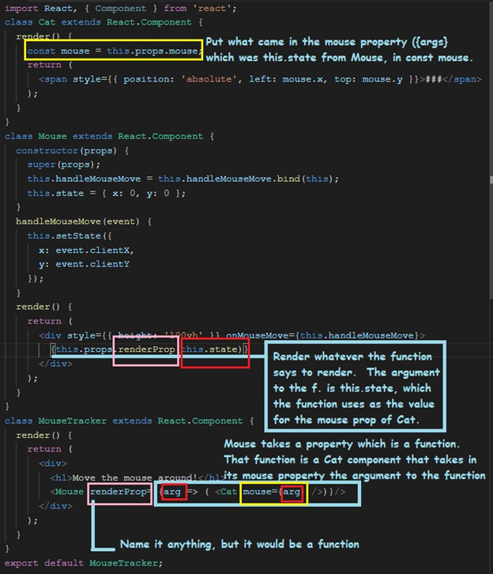

# React Notes 1

## Create and run
To create the default React App, go to your terminal in Visual Studio Code and run

`npx create-react-app TheNameYouWantForYourApp `

To run it, move to that folder and `npm start `

If you are cloning a repo, you can create some app first, then replace the files with the repo, since the repo is going to have "the code files" and not all the React files that are needed to run it.

By default, the app will start running in the webbrowser at localhost:3000 (Angular ones start at 4200)

#### Never run npm run eject!! 

Note: you could also do npm install -g create-react-app to install it and then jus type create-react-app TheNameYouWantForYourApp in the folder where you want the app.  The -g indicates to install it globally, so it can be accessed from any folder. 

## A basic React app

I find this site extremely helpful to try your code (simple) and see how it will work.  Going to https://stackblitz.com/edit/react-ajunq2 will also give you an idea of how a React app works. 

You will have an index.html file (look for it under the public folder), which will start the whole thing.  This file will have a div with an id where the React component (the main one) will be loaded.  You need an id so you can access the element later.

You can have whatever you want in there, but it needs this
 `<div id="root"></div>`

There should also be an index.js file.  This file will have this, which is what will load the component into the element. 

`
render(<App />, document.getElementById('root'));`

The App could be:
```
class App extends Component {
  constructor() {
    super();
    this.state = {
      name: 'React'
    };
  }

  render() {
    return (
      <div>
        <Hello name={this.state.name} />
        <p>
          Type something here to show it :)
        </p>
      </div>
    );
  }
}
```
Notice the render and the return.  That is where we will put the React or HTML elements we want to see on the page.  

In the code above, there is another React component being used, Hello, which we are setting to the state value (state.name) we set in the constructor.  This component could be (Hello.js file):

```
import React from 'react';

export default ({ name }) => <h1>Hello, look what was passed to me: {name}!</h1>;
```
A package.json file will also be created when you create the React app.

## React Components

React components are created with JSX, and the files should have that extension.  JSX looks like a mix of JavaScript and HTML.  (The Hello.js above doesn't have any HTML in it, so that's just js)

In a JSX file, we can be writing JavaScript code, with what looks like HTML tags, but they are not HTML exactly, so some things will be different and if you forget, you may run into problems. For example, class is for HTML, and the JSX equivalent would be className.  Also, tabindex in HTML will become tabIndex in JSX. 

To use any variables from the JS part of the file into the elements in the file, add {}, like in `<h1>{title}</h1> `

You can create elements by using React.createElement, but I think it’s easier to type the element itself the way you want it

You can create components as classes or functions.  Creating the component as a class will let you extend from the Component class in React and it will provide more features. 
If you need a constructor (which will run once) you will need to create a class. 
It is possible to use state with functions using hooks, but if you create a class (which will extend the React.Component class), you can use state for multiple variables easily.  More on state later. 

## Function Component

An example of a function component would be: 

```
import React from "react";

function Whatever () {
    return(
            <React.Fragment>
                ..some things in here
             </React.Fragment>
        )
};
        

export default Whatever;
```

Or you could also get something passed to it.

```
function HelloThere(props) { 
     return (<h1>Hello There {props.name} </h1>) 
} 
export default HelloThere; 
```
#### Note:If you need to return more than one element, you will have to wrap those elements into a higher element or it will not work. 

```
function HelloThere() {    
    return (<div> 
       	 	<h1>Hello There </h1> 
                  <h2>hey</h2> 
            </div>); 
   } 
   export default HelloThere; 
```
Add the **export default** at the end so when you need to import this component into another one React will know that HelloThere is the component that it needs to use, otherwise you will have to specify it. Notice there is no render on the function. 

The function is a regular JavaScript function and could be done with this syntax too: 

```
const HelloThere = (props) => ( 
           <h1>Hello There you </h1>) 
```

## Class Component

This class is so simple that a function should be used instead, but this is how it would be. 

```
import React, {Component} from 'react'; 
class HelloThere extends Component {    
    constructor(props){     
        super(props);  
        //whatever we need to do here to set state if we are using it 
    } 
    
    render() { 
        return( 
            <React.Fragment> 
                <h1>Hello There you </h1> 
            </React.Fragment> 
    ) 
 }; } 
export default HelloThere; 
```
`<React/Fragment> `is used as a parent div so we are returning only one element at the top level. 

## Importing the components 

How we import a component on another file will depend on whether the file containing the component we want has a default or not.  (export default).

Say we have a file that has two components, Component1, Component2. 
In that file we can export both components with: 

`export { Component1, Component2 } `

Then when we are going to use them in another file we would need to do: 

`import {Component1, Component2} from './ componentsAreInThisFile' `

If we try to import Component1 with this, it will fail because Component1 was not exported as default. 
`import Component1 from './ componentsAreInThisFile' `

We could export components from the file, plus the default one this way: 

```
export {Component2}; 
export default Component1; 
```

Then we could import them this way (Component1 being the default one): 
`import Component1, {Component2} from './ componentsAreInThisFile'; `

Note: When importing, you could name the component whatever you want, it does not have to match the name of the component in the file you are importing.   But maybe better to just keep them the same.

## State and Props (No Hooks) 

### What is State? 

You use the state to store values that correspond to elements on your component.  When the element must change you update the state and React will know to update that element (or elements) based on the change.  This is how you do not have to render all the elements after something in one of them changes. 
For example, if you need to display a header with Hello or Bye depending on something on your code, you can use state to store the greeting, and then you would use that on your element `(<h1>{this.state.greeting}</h1>)`.  Then when you changed the value of the greeting React would know that it needs to render the `<h1>` again. 
When you have different components that may need the same state, instead of having each component have its own state and your code trying to keep up with communication among the different components, bring the state to the common ancestor of those components. 


### State – set it and update it 

You will set the state in the constructor by assigning it a value, but if you want to change the value later on you must use setState and not change the value directly. 

```
constructor() {   	
    super(); 
    this.state = {	name: 'React', name2:'So Cool '   }}; 
 } 
 ```
To update the state later, you will use setState, which can take only the new values, or also a function to be called once the state is updated by React. 

```
this.setState( {name2: someVariableOrValue}, this.someFunctionThatWillBeCalle dWhenStateChanges); 
```

The reason we can pass that second argument for React to call a function once the update has happened, is that React may not update the state value right away.  We could call this.forceUpdate() after this.setState though to make React update at that time. 


Note: if you are doing something and it should work but you keep getting an error, check if you forgot to use “this”. 

You can pass the state to a component inside your component (child component) inside props, but this is like passing an argument by value.  You will not be able to update the state in the parent component from the child component. 

### What if the child component needs to update the state of the parent component? 

One thing we could do is pass a function in the parent to be called by the child when something happens, and then have the parent change the state in that function. 

You have a canvas.jsx component.  This component imports another component called TextFieldWithButton.  These are the things that TextFieldWithButton takes as props: 

```
<TextFieldWithButton textForInput = "Enter you text" textForButton="To canvas!" functionToCall= {this.updateCanvas}/> 
```
All the attributes above will be passed to the TextFieldWithButton component as props.  The functionToCall attribute will pass {this.updateCanvas} which is a function in the parent that will update the state. 

In the child component (TextFieldWithButton), the parent function will be called this way. 

```
this.props.functionToCall(“someValueYouWantToPassBack”); 
```
functionToCall was this.updateCanvas from the parent, so that is what will be called.  The function in the parent will take an argument. 

### Taking in the props 

In the receiving component (class or function), we can just have props or we can name each prop we want to take. Name each one and access by name only: 

```
const Hello = ( {name, name2}) => {       
    return <h1>Hello {name} and {name2} !</h1> 
}
```

### Props vs props.children 

Props are passed in like we saw in the above examples.  Props.children is passed automatically  to components (we don’t need to name them).  

```
render() {        return ( 
         <div> 
           <Hello name={this.state.name} name2={this.state.name2}> 
             <h1>hello header</h1>  
             <h2>hello header 2</h2>o 
           </Hello> 
    </div> 
    )}  ; 

```

Then in Hello we can access those through {props.children} 

### Rerender when state did not change 

Sometimes you may need for something to render again even though the value being displayed from the state has not changed.  In that case, add a new state property that (you may call it key) and use it in the component similar to this

`<Component key={this.state.selectedLetter}/> `

Then change the key state when you want the component to re-render. 


## Useful methods you get with your React class component 

### render 

All your class components will need this method.  This is what will return what the element will look like. 

```
render() {     return( 
        <React.Fragment> 
            <input type="search"></input> 
            <button onClick={this.sendTheText}>Button</button>         
        </React.Fragment>                       )}; 

```

### Constructor 

Used for initializations and setting state.  If you are using regular functions (as opposed to arrow functions) you can also do the bindings here. 
The constructor is called before the component is mounted.  Calling super(props) should be the first line in the constructor, since otherwise props will be undefined in the constructor, which could lead to problems. 
Remember this is the only place where you can set state directly (without using setState()) 

### componentDidMount() 

This is called right after the component has rendered.  Put code that needs to happen only after the component is available here.  You should add any subscriptions here. 

### componentDidUpdate() 

This is called after the component is updated. 

### componentWillUnmount() 

Called right before the component is unmounted and destroyed.  This is where you should perform any clean up you may have to do.  This includes cancelling subscriptions you may have added in componentDidMount. 

## Basic Examples 

For each one of this create the react app with npm create-react-app 

### Example – Very simple app with very simple component 

Index.html: 

```
After me, the div element that will display the React component 
<div id="root"></div> 
```
Index.js: 

```
import React, { Component } from 'react'; import { render } from 'react-dom'; import Hello from './Hello'; 
 
class App extends Component {   
    constructor() 
    {     
        super();     
    }  
  
    render() {     
        return ( 
            <div>       
                <Hello />         
            </div> 
        ); 
    } 
}

render(<App />, document.getElementById('root')); 
```

Hello.js 

```
import React from 'react'; 
export default () => <h1>Helloooo !</h1>; 
```

### Example – The component takes one argument 

Index.html: 

```
After me, the div element that will display the React component 
<div id="root"></div> 
```

Index.js: 

```
import React, { Component } from 'react'; 
import { render } from 'react-dom'; import Hello from './Hello'; 
 
class App extends Component {   
    constructor() {     
        super();     
    } 
render() {     return ( 
      <div>       
        <Hello name="Willie" />       
      </div> 
    ); 
  } } 
render(<App />, document.getElementById('root')); 

```
hello.js: 

```
import React from 'react'; 
export default ( {name}) => <h1>Helloooo {name}!</h1>; 
```

## Example – The component takes arguments from props 

Index.html: 

```
After me, the div element that will display the React component 
<div id="root"></div> 

```
Index.js: 

```
import React, { Component } from 'react'; 
import { render } from 'react-dom'; import Hello from './Hello'; 

class App extends Component {   
    constructor() 
    { 
        super();     
    }    
    
    render() { return ( 
      <div>       
        <Hello name="Willie" lastName="Wilson" />       
      </div> 
    ); 
  } 
}  
render(<App />, document.getElementById('root')); 

```

Hello.js 

```
import React from 'react'; 
 
function Hello(props){ 
  return <h1>Helloooo {props.name}, {props.lastName}!</h1>;   
} 
export default Hello 

```

### Example – Same as above, but with class component 

The only file that changes is the Hello component. 

```
import React , {Component} from 'react'; 
class Hello extends Component{   
    constructor(props){     
        super(props); 
        //nothing to do 
    }   
    render(){ 
        return <h1>Helloooo {this.props.name}, {this.props.lastName}!</h1>;   
    }     
} 
export default Hello 
```
### Example – Using state 

The example similar to the above ones, but the Hello component has changed. 

```
import React , {Component} from 'react'; 
class Hello extends Component
{   
    constructor(props)
    {     
        super(props); 
        this.state = {display:this.props.name}; 
    } 
    changeState = () => {     
        let date = new Date();     
        this.setState({display: this.props.name + "-" + date.getSeconds()});         
    }   
    
    render(){     
        return(  
            <React.Fragment> 
                <h1>Helloooo {this.state.display}!</h1> 
                <button onClick={this.changeState}>Change State</button> 
            </React.Fragment> 
        ) 
    }     
}

export default Hello 

```

## Events in React. 

Events are similar to how they are done in regular HTML. 

### Setting onClick to the handler 

With regular HTML you would do this: `onclick="activateLasers()"`, but with React you will do this: ` onClick={this.activateLasers} `

Notice that you do not include the ().  You can do it (not for functions that will update state though), but the function will be called when the component loads so you need to keep that in mind.   

### Prevent default behavior 

With HTML you can just use “return false” to prevent the default behavior of an element. 
With React, you need to call preventDefault yourself. 

```
<a href="http://goingNowhere" onClick={this.linkDoNothing}>link to nowhere</a
>   linkDoNothing = (e) => { 
    e.preventDefault(); 
  } 
```
When you click the above link in the browser nothing will happen. 
Remember that if you do not use arrow functions in the file (class fields syntax) you will have to bind the functions on the constructor.  Otherwise, you will get undefined errors.  You can also use the arrow functions in the callback to avoid having to bind (OK in most cases but may affect performance): 

`onClick={() => this.handleClick()} `

### passing arguments 

If you need to pass arguments to the handler function, use this form so you do not end up calling it on load: 

`onChange = { () => this.checkedLetter("M")} `

## Advanced Concepts 

### Context 

Props are used to pass data around between components, but some things are going to be used but a lot of components in the app (like a configuration value) and passing them all over the place with props can get to be a lot.  Context is another way to approach that situation. 

```
import React, { Component } from 'react'; 
import { render } from 'react-dom'; import Hello from './Hello'; 
 
const MyContext = React.createContext(); 
class App extends Component {   
    constructor() 
    {    
         super();    
    }   
    render() {     
        return ( 
            <MyContext.Provider value="hey">               
                <Hello name="Willie" lastName="Wilson"/>                     
            </MyContext.Provider>       
        ); 
    } 
} 
export {MyContext} 

render(<App />, document.getElementById('root')); 

```
Hello.js has not changed and it’s still using props: 

```
import React , {Component} from 'react'; 
import HelloSub from './HelloSub'; 

class Hello extends Component
{   
    constructor(props)
    {     
        super(props); 
    }   
    render(){     
        return(  
            <React.Fragment> 
                <h1>Helloooo {this.props.name}!</h1>      
                <HelloSub/>                
            </React.Fragment> 
        ) 
    }     
} 
export default Hello 

```

HelloSub makes use of the context. 

```
import React , {Component} from 'react'; 
import {MyContext} from './index'; 
 
 class HelloSub extends Component{   
    constructor(props){     
        super(props); 
    } 

  render(){             
    return(  
      <MyContext.Consumer> 
        {context => ( 
          <React.Fragment>         
            <h1>Helloooo! I'm the sub and the SomeContext is {context}</h1>                       
          </React.Fragment>         )} 
      </MyContext.Consumer> 
    ) 
  }     
} 
export default HelloSub 

```


### Error Boundaries 

Error boundaries are React components that catch JavaScript errors anywhere in their child component tree, log those errors, and display a fallback UI instead of the component tree that crashed.  They catch errors during rendering, but they do not catch all kinds of errors (server side, event handlers, async code). 
You create an Error Boundary by creating a class that has methods static getDerivedStateFromError() and/or componentDidCatch(). 


Create the class for the error boundary component and as the state keep the possible error messages.  Then in the render, check the state and display the error or if no errors, just render the children (since you will use this component to wrap other components, those will be the children). 

```
class ErrorBoundary extends React.Component {     
    constructor(props) {       
        super(props); 
        this.state = { error: null, errorInfo: null }; 
    } 

    componentDidCatch(error, errorInfo) {           
        this.setState({         
            error: error,         
            errorInfo: errorInfo 
      })     
    }  

    render() { 
      if (this.state.errorInfo) {               
        return ( 
          <div> 
            <h2>Something went wrong.</h2>           
            {this.state.error && this.state.error.toString()}             <br /> 
            {this.state.errorInfo.componentStack}           
          </div> 
        ); 
      } 
      // if there were no errors       return this.props.children; 
    }   
  } 

```

Then you will use it like a regular component.  It will use of the errors thrown on the children component.  If the ErrorBoundary component itself has an error it will be propagated up. 

```
<ErrorBoundary> 
    Some components here 
</ErrorBoundary> 

```
For errors in event handlers etc, just use the regular JS try catch. 

### Refs and Forwarding refs 

#### React.createRef() 

With refs you can access an element of your component directly.  Easier to understand with an example. 
You have a canvas element in your component and you set ref to a variable in your code: 

`<canvas style ={canvasStyle} ref={this.refToCanvas}       />    `

Note that you use {}, not a string. 
Your variable is set in the constructor: 


```
constructor(props) {        
  	super(props);               
    this.refToCanvas = React.createRef();                  
} 

```
Now you can access that element directly in your code.  Speaking of canvas, I do this so the points where you touch are accurate.

`this.refToCanvas.current.width = this.refToCanvas.current.clientWidth; `

Note how you access the element by using the this.refToCanvas.current. 
You can use the refs in HTML elements and class components, but not on functions. 

#### Callback Refs 

You can accomplish the same thing as above by using callback refs.  Again easier with an example: 


same thing, just for copy paste:
```
import React from 'react'; 
 
class Hello extends React.Component {   
    constructor(props) {    
         super(props); 
        this.textInput = null; 
 
        this.setTextInputRef = element => {      
             this.textInput = element; 
    };  

    this.alertTextInput = () => {             
        if (this.textInput)  
            alert(this.textInput.value); 
    }; 
  }    
  
  render() {         
    return (       
        <div>         
            <input   
                type="text"  
                value="my Value" 
                ref={this.setTextInputRef} 
        />         
        <input           
            type="button"          
             value="Alert" 
            onClick={this.alertTextInput} 
        /> 
      </div> 
    ); 
  } } 
export default Hello; 

```

#### This.refs – Should be refactored 

React also has a this.refs but it is not recommended and is obsolete (used a string in the element, not the {}). 
Here are some hints if you decide to refactor your this.refs to using React.createRef: 
In the constructor: 


Accessing: 


In the element: 


#### Forwarding Refs 

This allows us to pass refs though a component to its children.  This only works when the component that receives the red is created with React.forwardRef. 
Create the component with forwardRef: 

```
const ButtonThatGetsARef = React.forwardRef((props, ref) => ( 
    <button ref={ref}> 
  Something here 
    </button> 
  )); 

```

Create the ref that will be passed to the component that takes the ref.  This way the 
component using ButtonThatGetsARef can access the `<button/>` inside ButtonThatGetsARef from the ref: 

```
const ref = React.createRef(); 
< ButtonThatGetsARef ref={ref}>Click me!</ ButtonThatGetsARef >; 

```

#### useRef 

This is a React hook and will be covered later. 

### HOC – Higher Order Component 

With this we take advantage of an existing component to create a new one which has things in common with the first one (this is not inheritance per se though it has some of its benefits).  Do not do this in the render method.  The new component will not have any of the static methods from the original component.  Props will be passed to the new component but refs will not. 
 
A higher-order component is a function that takes a component and returns a new component.  It is not part of the React API. 
This has been very confusing to me for whatever reason so taking it one step at a time with the examples: 


The component used only displays a “hey” and the function used to create the HOC version only has a console statement in the componentDidMount method.  
The file only exports the HOC component: 


We will get the hi in the console and the hey in the browser. 

Changing it a bit so we log the props passed to the component instead of just “hi”. 


We can use the props in the original component if we pass them in the function.  If index is still using the HOC : 


Besides the props, we can pass additional props this way 


The function that creates a new component from the original component can also take other arguments and use them to do whatever in the code, then pass whatever results like we did with dataAdd=”Something else here”. 
Pasting only the code form of the last example since that is the one that includes the previous ones. 

```
import React, { Component } from 'react'; 
import { render } from 'react-dom'; import CompFromHOC from './Hello'; 
 
class App extends Component {   
    constructor() { 
        super();     
        this.state = {       
            name: 'React' 
        };   
    }   
    render() {     
        return ( 
        <div> 
            Components bellow:   
            < CompFromHOC arg1="I am arg1"/>      
        </div> 
         ); 
    } 
} 

render(<App />, document.getElementById('root')); 

```

```
import React from "react"; 
 
class Component extends React.Component {   
    constructor() {     
        super(); 
    }   
    
    render() {     
        return (               
            <React.Fragment> 
                <h2>hey</h2>    
                <h1>{this.props.arg1}</h1> 
                <h1>{this.props.dataAdd}</h1> 
            </React.Fragment> 
        ); 
    } 
} 

function createNewComponent(WrappedComp) {   
    class NewComp extends React.Component {     
        constructor() {       
            super();       
        } 
    componentDidMount(){      
         console.log("hi"); 
        console.log(this.props.arg1); 
    }      
    render() {        
        return ( 
            <WrappedComp  {...this.props} dataAdd="Something else here"/> 
      ) 
    }       } 
  return NewComp; 
} 

const CompFromHOC = createNewComponent(Component); export default CompFromHOC ; 

```

### Render Props 

It is a technique used to share code between React components.  It is done though the use of a prop with a function value. 
A component with a render prop passed to it will take a function which will return a React element.  It will call this function instead of implementing its own logic. 



```
import React, { Component } from 'react'; 
class Cat extends React.Component {   
    render() { 
        const mouse = this.props.mouse; 
        return ( 
        <span style={{ position: 'absolute', left: mouse.x, top: mouse.y }}>###
        </span> 
    ); 
  } 
} 

class Mouse extends React.Component {   
    constructor(props) {     
        super(props); 
        this.handleMouseMove = this.handleMouseMove.bind(this);     
        this.state = { x: 0, y: 0 }; 
    } 

    handleMouseMove(event) {     
        this.setState({       
            x: event.clientX,       
            y: event.clientY 
        });   
    }   
    render() {     
        return ( 
            <div style={{ height: '100vh' }} onMouseMove={this.handleMouseMove}>        
                {this.props.renderProp(this.state)} 
            </div> 
        ); 
    } 
} 

class MouseTracker extends React.Component {   render() {     return ( 
      <div> 
        <h1>Move the mouse around!</h1> 
        <Mouse renderProp= {arg => ( <Cat mouse={arg} />)}/> 
      </div> 
    ); 
  } } 
export default MouseTracker; 

```

### Routing 

You need to install a package to use React routing.  There are three packages that you have available: 
React-router has the core components and we don’t install it directly, it will get there with any of the other two packages. 
React-router-dom for web apps React-router-native for mobile. 
Install the one you need with “npm install” and the package name. 
 
The react-router library has various components, the most common ones being: 
BrowserRouter: It uses the HTML5 history API (pushState, replaceState and the popstate event) to keep your UI in sync with the URL. It is the parent component that is used to store all the other components. 
Route: Route is the conditionally shown component that renders some UI when its path matches the current URL. 
Link: Link component is used to create links to different routes and implement navigation around the application.  Similar to <a href…> 
Switch: Switch component is used to render only the first route that matches the location rather than rendering all matching routes.  
 
This is how you would import some of those components: 

`import {Route, BrowserRouter as Router, Switch} from 'react-router-dom'; `


In you index.js file you can have a const with the routing options and then use that on the render. 
At the end of the index.js: 

```
ReactDOM.render(                    
    routing ,       
    document.getElementById('root')); 

```
The routing above is created with route options like these: 


In the above screenshot, when the path indicated is the browser’s url, the corresponding component will be displayed. 
If you want to include the navigation bar on all the pages, include the navigation component before the Router as above. 
The above code provides routes to pages in the application (main components) but note that as of right now this will not work on github pages. 
You may also want to use links in your pages.  This is how. 

`import {Link} from 'react-router-dom'; `

```
Link to= {path + "/bdpq"}>                                                    <!—other things you may need here, such as the text for the link→  /Link> 
```


Notice that link will work like an anchor tag (`<a href`) and notice that the above path is the same as it was used in one of the ROUTE components.  One is a link, the other one will take you to the right place from the url in the browser. 

## Hooks

Like I mentioned, you can use functions or classes to create React components, but classes come with more functionality.  Hooks is React way to provide some of that functionality to functions. 
React says they are not planning on replacing classes with hooks, and it is OK to just start using hooks in new code, leaving existing code the way it is. 
Hooks are mainly used to deal with state and effect.  You can also create your own custom hooks.   There are other less used React hooks so check the documentation for those. 
Hooks are JavaScript functions but they have a few rules: call them at top level (not inside code blocks), call them only from React functions. 


### State Hook 

This is the same example as both a class using state and a function using the hook for state (handling initial state): 


Notice that for the hook you need to import it (useState). 
When we need to change the state: 


You can have multiple variables created by useState on the same function.

### Effect Hook 

The effect hook lets you perform side effects in function components.  This hook takes the job of componentDidMount and componentDidUpdate since it will happen after the component is rendered (or re-rendered). 
As before, here is the same example with both using a class and using a function.  
Note that we now must import useEffect. 


It seems weird that React will still the useEffect that only refers to a variable that has not changed.  To change that pass an array with the variables to skip if unchanged as a second argument: 

`useEffect( () => {alert(drink);}, [drink]); `

If there are multiple elements in the array passed as the argument, useEffect will be called when at least one changed. 

## Some Additional Notes

### Functions in React components 

Most of the time, when creating functions in React components we will be using the arrow function format: 

```
onClick = { (e) => this.deleteRow(id,e)}... 
sendTheTextBlank = () => {     
    //something to do  
} 

```
If we use regular functions we need to remember to bind them or we will run into problems.  You can do that in the constructor. 

`this.handleSomething = this.handleSomething.bind(this); `

The reason for this is that arrow functions do not their own “this” so there is no confusion about what “this” we are referring to inside the function.  

### github pages with .env 

If you have not done so, install the github pages package (inside your app folder or with the -g option for all): 

`npm install gh-pages — save-dev `

In the package.json of your app, add this: 

```
"name": "yourreponame", 
  "version": "0.1.0", 
  "private": true, 
  
  	"homepage": ".",
 
{ 

```
Some articles say to include the github repo where the page will be hosted (https://{username}.github.io/{repo-name}), but then it will not work when you run locally.  Instead, set it that way and use a .env file. 
You also need to modify the package.json here: 


```
"scripts": { 
    "start": "react-scripts start", 
    "build": "react-scripts build",     "test": "react-scripts test", 
    "eject": "react-scripts eject", 
    "deploy": "gh-pages -d build"
  }, 

```
Optionally you can also add a predeploy so you don’t have to run the build manually before you deploy it.  I prefer to just build and deploy manually.  You would add this to the scripts section of the package.json. 

`“predeploy”: “npm run build” `

Create a file .env and put it in the root directory of your app (same leve as the src folder).  This is what will allow you to have the homepage set to “.” On your package.json so you don’t have to be changing it to run locally.  You will still have to remember to change this file but personally I find this more organized. 

You can use this file to set environment variables that you can use in your app’s code: 


Now wherever you need to use paths in your code, you can do this: 

```
const path = process.env.REACT_APP_FOR_PATH; …. 
 
<img src= {path +"/images/YourImage.png" 
```

You can name the variables anything you want, but they must start with 
REACT_APP 
 
Remember to change the variable to what you need before you build and before you run locally. 

Npm start → remember to set the .env file to  

`REACT_APP_FOR_PATH = `

To deploy to github pages → .env set to your github repo. 

```
npm run build 
npm run deploy 
```

There is also this article I wrote, because the routing and the env file were pretty confusing:

https://gmfuster.medium.com/deploying-a-react-app-to-github-pages-24c3e5485589

