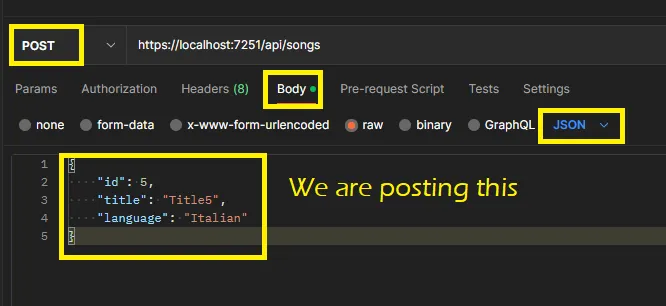
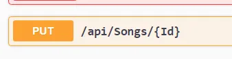
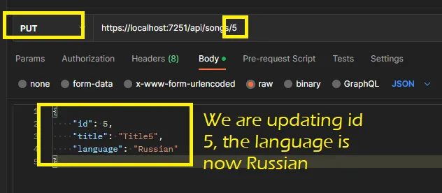

# Start an Entity Framework Code Project—1

## Create the Project

In Visual Studio Community (I am using the most recent version), go to Create New Project and choose ASP.NET Core Web API. You don’t have to be creating an API to use EF, you can also use it in a console project or whatever you want).

Take the defaults and you will end up with some of the files you need already there.

## Some Background Info

EF is used in a .Net app to communicate with the database. When you are dealing with the database, we have what we call CRUD operations.

Create — POST

Read — GET

Update — PUT

Delete — DELETE

There is also a PATCH option but it’s not that common.

The above (right side) are the type of requests we can get from a browser or some application accessing our APIs. We use codes to communicate how the request is going. Some of the most common are:

200 OK

400 Bad Request

401 Unauthorized

403 Forbidden

404 Not Found

406 Not Acceptable

500 Server Error

503 Service Unavailable

201 Created

202 Accepted

204 No Content

405 Method Not Allowed

415 Unsupported Media Type

## The Database in SQL Server

Once you have installed SQL Server, you can create your own DB or use one that is available (you can google “download the northwind database” and see what comes up). I am using a Northwind DB and I added a new table, with just 3 columns (id, title, language). The table name is Songs.

## EF — Code First or DB First

With code first you will create your DB and tables from the code. With DB first you already have your DB and then your code needs to match your tables. In my experience, the DB is maintained on its own, and the code uses it, so I’ll be using the DB first approach.

Regardless of the approach, you will need an entity model class to match each table, and a controller class for the table and the actions you are going to have on it.

## Establish How You Will Connect to the DB

You will need a class that inherits from DbContext (refers to the DB). This class will be something like this (you can name yours whatever you want):

```
public class APIDbContext : DbContext
{
  public DbSet<Song> Songs { get; set; }

  public APIDbContext(DbContextOptions<APIDbContext> options) : base(options)
  {

  }
 }
}
```
If DBContext refers to the database, a DbSet refers to a table.

Once you have your DB, you need to tell your app how to connect to it. Open the program.cs file and look for var app = builder.Build();

At some point before that, you will want to add something like this:

```
builder.Services.AddDbContext<APIDbContext>(option => option.UseSqlServer("Data source= YOUR_SERVER\\YOUR-INSTANCE;" + "Initial Catalog=Northwind;" +
  "Integrated Security=true;" + "MultipleActiveResultSets=true;"));

```
Your connection string may not be exactly the same. If you get an error with the certificate, you can try setting the string to include Encrypt=False.

## Set the Model and the Controller for the Songs table

The model should match the table:

```
public class Song
 {
  [Required]  
  public int Id { get; set; }

  [Required]
  [StringLength(100)]
  public string Title { get; set; }

  public string Language { get; set; }
 }
 ```
 The controller has the actions:
 ```
 [Route("api/[controller]")]//this will determine the url to call the action
[ApiController]
public class SongsController : ControllerBase
{
  private APIDbContext _dbContext;
  public SongsController(APIDbContext dbContext)
  {
   _dbContext = dbContext;
  }  

  [HttpGet] //could just name it Get
  public IEnumerable<Song> GetSongs()
  {
   return _dbContext.Songs;
  }

  [HttpGet("{id}")] 
  public Song GetSong(int id)
  {
   return _dbContext.Songs.Find(id);
  }

  //add FromBody to let it know that the data we need to add is coming 
  //from the body of the request.
  [HttpPost]
  public void PostSong([FromBody] Song song)
  {
   _dbContext.Songs.Add(song);
   _dbContext.SaveChanges();
  }

  [HttpPut("{Id}")]
  public void PutSong(int id, [FromBody] Song song)
  {
   Song s = _dbContext.Songs.Find(id);
   s.Title = song.Title;
   s.Language= song.Language;
   _dbContext.SaveChanges();
  }

  [HttpDelete("{id}")]
  public void Delete(int id)
  {
   Song s =_dbContext.Songs.Find(id);
   _dbContext.Songs.Remove(s);
   _dbContext.SaveChanges();
  }
 }
 ```
 Notice that using the attribute to indicate the type of action, I can name the method whatever I want. Let’s look at one at a time.

 ## Running the App and Making the Calls

 When you start running the app from Visual Studio, you will have Swagger come up. (If you get a message about issuing a certificate, you can say No and on the browser you will just have to click continue on the warning).

Once Swagger comes up, you can see what actions you have available.

Note: From postman (if you use that to make the calls) you cannot just say continue without the certificate, but you can click on settings and turn SSL certification validation off.

## Let’s call get to get the songs from the DB:

```
[HttpGet] //could just name it Get
  public IEnumerable<Song> GetSongs()
  {
   return _dbContext.Songs;
  }
  ```
  to call it, `http://localhost:7251/api/songs`

  And we will get back (status 200OK):

  ```
  [
    {
        "id": 1,
        "title": "Title1",
        "language": "Frend"
    },
    {
        "id": 2,
        "title": "Title2",
        "language": "German"
    },
    {
        "id": 3,
        "title": "Title3",
        "language": "Spanish"
    },
    {
        "id": 4,
        "title": "Title4",
        "language": "English"
    }
]
```
## Let’s call to get 1 song from the database.

`http://localhost:7251/api/songs/4`

It will still give status 200 and return only the one with id=3.

## Let’s post a song




## Let’s put a song, which means, update one.







## And now, let’s just delete the last one because we are just not sure


## How does it know what table to go to?

You need to name the entity and the table the same way, except, there are some conventions that EF follows and you may be able to override some of those. In my example the entity model is Song. But the DbSet is Songs.

However, if you are working with an existing DB and you don’t like those table names for your models, you can do something like this and it will still work.

On the entity model, use an attribute like [Table(“tbl_name_in_db]

Or if using fluent API (later) it would be .ToTable(“tbl_name_in_db”)

## OnModelCreating

EF is going to figure out many things about your database because you are following the naming conventions. However, there may be times when you want to be more speficic. In this case you can add code like this in your DBContext class.

```
public class APIDbContext : DbContext
{
  public DbSet<Song> Songs { get; set; }

  public APIDbContext(DbContextOptions<APIDbContext> options) : base(options)
  {
  }

  protected override void OnModelCreating(ModelBuilder modelBuilder)
  {
        modelBuilder.Entity<Song>()
            .Property(s => s.title)
            .IsRequired(); //set the title property to required
  } 
}
```
You had already done that using an attribute in the Song class itself, but this is using fluent API to do it. You could set more than one property. For example, in a Product entity for a Products table you could do:

```
 modelBuilder.Entity<Product>()
                .Property(product => product.ProductName)
                .IsRequired()
                .HasMaxLength(40);
```

## Some Additional Info
 
 If we want to name a property for a column with a name different than the name in the table:

 ```
 //UnitPrice is the name in the table.
[Column("UnitPrice", TypeName ="money")]
public decimal? cost { get; set; }

```
Back in OnModelCreating:
```
//do not bring back in queries if the price is >= 50
modelBuilder.Entity<Product>().HasQueryFilter(p => p.cost < 50);;
```
EF 6 and above let you create preconvention models, meaning, attributes that will be shared across the board, something like this (still in APIDbContext):
```
protected override void ConfigureConventions(ModelConfigurationBuilder configurationBuilder)
{
   //apply this max to all string columns
   configurationBuilder.Properties<tring>().HaveMaxLength(75);
             
   //or have a custom interface IDoNotMap and make sure none of 
   //the properties implementing it are mapped
   //can also put a type in the IgnoreAny
   //Could have also used [NotMapped] in a particular property.
   configurationBuilder.IgnoreAny<IDoNotMap>(); 
}
```
EF will let you do different things besides Find and Add, you could do also sort by something , or filter, or query by using linq.

## _dbContext.SaveChanges();

Notice that in my code after each action I have called SaveChanges on the DbContext. You don’t have to do it. You could accumulate a few adds, puts etc, and then call SaveChanges() at the end. When you do, all actions will be sent to the DB. Keep in mind nothing will really happen in the DB if you don’t call SaveChanges.

SaveChanges will start a transaction. It will only commit if all the changes succeed. You can control explicit transactions with Database of DBContext. You need to import Microsoft.EntityFrameworkCore.Storage. If you control the transaction manually, it will be something like this:

```
using (IDBContextTransaction t = db.Database.BeginTransaction())
   //...do whatever
   //after SaveChanges
   t.commit();
```
## Status Codes

If we want to return a specific status code we need to change our methods a bit. Let’s see the Get which is the simplest one. Right now I have:

```
[HttpGet] //could just name it Get
public IEnumerable<Song> GetSongs()
{
   return _dbContext.Songs;
}
```
Could change it to this:
```
public IActionResult GetSongs()
{
   return Ok( _dbContext.Songs);
}
```
Or this, if we want to be even more specific about the code since Microsoft gave us a ton:

```
public IActionResult GetSongs()
{
  return StatusCode(StatusCodes.Status200OK, _dbContext.Songs);
}
```
You can return a string or whatever is appropriate for each specific method.


