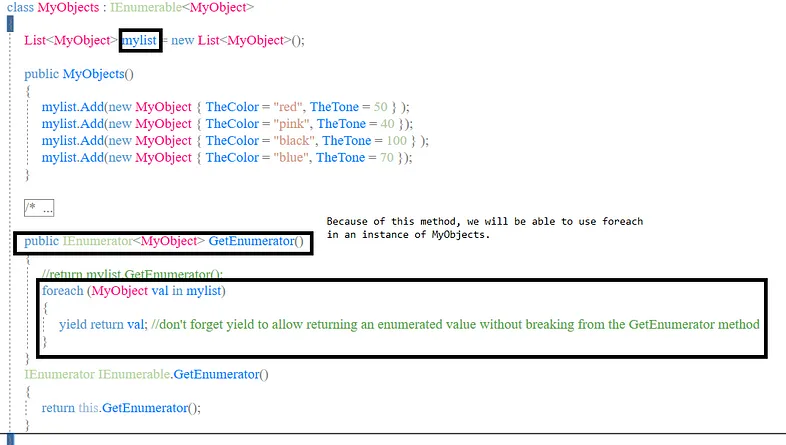
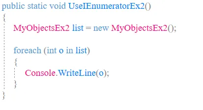

# Implementing some C# Interfaces and Extension Methods

## Extension Methods

With an extension method, you can add methods to whatever types / classes you have in C#. For example, below, we are adding an extension method to the string type. Then we can call that method from any string.


## INotifyPropertyChanged

Implement this interface when you have properties that need to trigger an event (changed) when they are changed. Trigger the event in the change of the property, and have whatever subscribers you want to it so you can do something when the notification comes.


## IComparable

Implement it when you want to provide a method to compare your classes.


Once you have the above, you can sort a list of ObjectForComparing types and it will be sorted based on the CompareTo:


## IComparer

IComparer is also used to compare two objects and it can be used for sorting your custom types. IComparable will help you in your sorting when you have control over the class you are sorting, so you can have the CompareTo the way you like it. However, it is possible that you have the ObjectForComparing objects, but instead of wanting the CompareTo in that class for your sort, now you want them sorting by some other way.

I’ll add some other property to that class, and then you will use that other property to sort your objects, instead of the index in the array {Lexus, Toyota, BMW, Ford}.

In the ObjectForComparing class we already have above, just add this new property:

` public int ThePrice { get; set; } `


## IEquatable

You know you can use equals to compare strings, and you want to have something similar for your class.


## IEqualityComparer

Similar to the IEquatable, but you create it in another class and the method will take 2 arguments to compare.

My example is a little silly but I’m just showing how this would be used, with whatever comparison you would need.


The above code is OK, but if you want the GetHashCode to work in accordance with the Equals, so for instance you don’t get duplicate keys in a Dictionary, it should look more like this:


## IEnumerable

You need to add this when you want to be able to iterate through custom collection.

I’ll use this type of object for the list.

```

class MyObject
{
   public string TheColor { get; set; }
   public int TheTone { get; set; }
}
```


In the code above, could have also used the commented out part instead of the foreach (return myList.GetEnumerator();)

To use it:


Instead of having the constructor add the objects to the list, we could also have it this way, in which case, we will add them to the list.


Note: With IEnumerable, the point is that you are going to have a list or array and you are providing a way to iterate through it in your GetEnumerator. It doesn’t matter if for your class you need to create the list through the constructor or by calling an Add method you create or however.

## IEnumerator

Notice that in the example above, the GetEnumerator() method returns a IEnumerator<MyObject>, so this is going to be related. IEnumerable and the use of foreach hide the complexity of the enumerator. But you can use your own Enumerator.

The example below takes a list of integers and provides the enumerator to iterate through it (never mind the name I gave).

The Enumerable object is still going to be similar to the one we used with IEnumerable:


To use it, it’s going to be similar than the IEnumerable one.



But notice that on my list I have added 1,2,3,4. But this is what I see in the console:

```
10
20
30
40
```

Why? because of the custom numerator:

Because I think this can get confusing, I changed the above code to work with a list of strings now, but it could be done with your specific classes too:


## C# 8 Default Interface Implementations

With c# 8 you can have a method in an interface with a default implementation. To do that just add the method to the interface but give it an implementation.

## C# 11 changes

Support has been added for static abstract members. Static memebers cannot use "this", so instead they will use "TSelf".

```
public interface IMe<TSelf> where TSelf : IMe<TSelf>
{
   public static abstract TSelf operator +(TSelf a, TSelf b);
   public static abstract TSelf SomeProp { get; }
}
```

Now we can create a class that implements that interface (use the ClassName in please of the TSelf).