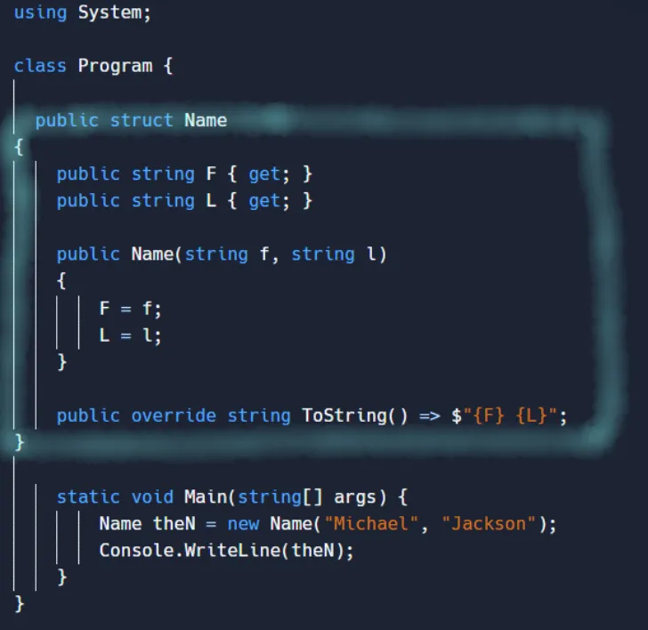
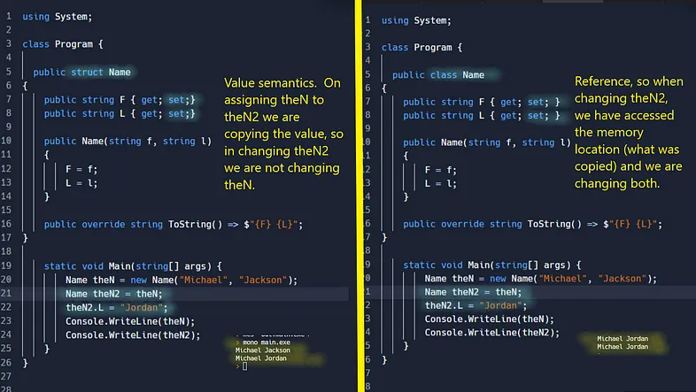

# Class, Struct, Record, Record Struct

## Summary of how they are defined, no examples.

From the MS docs.

Record: a class OR struct that provides special syntax and behavior for working with data models.

Class: a construct that enables you to create your own custom types by grouping together variables of other types, methods and events.

Struct: a value type that is typically used to encapsulate small groups of related variables.

Record Struct: Similar definition as the Record but when you want to specify that it’s going to be for a struct, not a class.

That’s all good but not near enough. Before records were introduced, we had classes and structures. Let’s go to those first.


## Structures (struct) vs Classes (class).

Let’s look at a structure here, which looks so much like a class:



From the MS docs:

Structure types have value semantics. Class types have reference semantics. This sounds like it’s important :-).




## More about structures

Also from MS docs: Typically, you use structure types to design small data-centric types that provide little or no behavior. Because structure types have value semantics, we recommend you to define immutable structure types.

To make the above structure immutable, we can use the readonly with it (C# 7.3 and up).

`public readonly struct Name`

If we do that, we need to remove the set; from the F and L properties so it compiles. Once we do that, we can set the value for the readonly fields/properties of the structure in the constructor but that’s it. This means, even members of the struct cannot change those fields/properties.

NOTE: If we have a reference type, like a List, it will be immutable in the way that you cannot assign it some other value, BUT, it can change itself in the way that the list can add and remove elements.

Our struct could now be:

```
public readonly struct Name
{
     public string F { get;  }
     public string L { get;  }
     public List<string> SomeList { get; }
     public Name(string f, string l)
     {
          F = f;
          L = l;
          SomeList = new List<string>();
          SomeList.Add("how");
          SomeList.Add("are");
          SomeList.Add("you");
          SomeList.Add("?");
     }
     public void ChangeList()
     {
          this.SomeList.Add("??");
     }
     public override string ToString() => $"{F} {L}";
}
```
Calling the ChangeList method on the structure will work and the ?? will be added. However, trying to assign a new list to SomeList in that same method will give a compile error.

Starting with C#9, properties can also get an init accessor. An init-only setter assigns a value to the property or the indexer element only during object construction. This enforces immutability, so that once the object is initialized, it can’t be changed again.

In the struct above we could have

```
public string? F { get; init; }
public string? L { get; init; }
//the constructor has not changed
//then create it like
Name theN = new Name { F= "Michael", L= "Jackson"};
```
Starting with C#10 you can also have a structure and create a copy of it with just some of the fields changed. Easier with an example. With the structure as before, you could create 3 instances this way:

```
Name name1 = new Name { F= "Michael", L= "Jackson"};
Name name2 = name1 with { L = "Jordan" };
Name name3 = name1 with { L = "Knight" };
Console.WriteLine(name1);
Console.WriteLine(name2);
Console.WriteLine(name3);
Michael Jackson
Michael Jordan
Michael Knight
```
## More about structures vs classes

As already mentioned, structures are value types and classes are reference types. In addition to that:

A structure type can’t inherit from other class or structure type and it can’t be the base of a class. However, a structure type can implement interfaces.

You can’t declare a finalizer within a structure type.

Prior to C# 11, a constructor of a structure type must initialize all instance fields of the type.

Prior to C# 10, you can’t declare a parameterless constructor.

Prior to C# 10, you can’t initialize an instance field or property at its declaration.

Structures are passed by value, though you can use ref to indicate that it should be passed by reference.

Starting with 7.2 you can also declare structures as reference type with the ref keyword, but they have limitations beyond the scope of this article.

## Records vs classes and structures

Records give a little extra to classes and structures. If you are going to use them for a class, just use record instead of class, if you are going to use them for structures, use “record struct”. You can also do “record class” but it’s not necessary.

You can use positional parameters to create and instantiate a type with immutable properties.

```
public record Name( string first, string second );
//create with
Name name = new Name("Michael", "Jackson");
Console.WriteLine(name); //Name { first = Michael, second = Jackson }
```
The same methods and operators that use reference equality in classes (such as Objects.Equals(Object) and ==), indicate value equality in records.

```
public record RecordName( string first, string second );
public class ClassName
{
   public string First { get; set; }
   public string Last { get; set; }
   public ClassName(string first, string last)
   {
      this.First = first;
      this.Last = last;
   }
}
...
RecordName recName1 = new RecordName("Michael", "Jackson");
RecordName recName2 = new RecordName("Michael", "Jackson");
ClassName className1 = new ClassName("Michael", "Jackson");
ClassName className2 = new ClassName("Michael", "Jackson");
Console.WriteLine(recName1.Equals(recName2));//True
Console.WriteLine(className1.Equals(className2));//False
```
You can use the with expression with records (like shown above for structures starting with c# 10)

A record’s ToString method creates a formatted string that shows an object's type name and the names and values of all its public properties.

A record can inherit from another record. A record can’t inherit from a class, and a class can’t inherit from a record (for record class types, not record struct ones).

```
public abstract record RecordName
{
   public string First { get; set; }
   public string Last { get; set; }
}
public record RecordNameDer : RecordName
{
   public string Middle { get; set; }
}
...
RecordNameDer name = new RecordNameDer  { First = "Michael", Last = "Jackson", Middle = "Joseph" };
//or could have also done
public abstract record RecordName(string First,string Last);
public record RecordNameDer(string First, string Last, string Middle) : RecordName(First, Last);
...
RecordNameDer name = new RecordNameDer ("Michael", "Jackson","Joseph" );
```
Record structs differ from structs in that the compiler synthesizes the methods for equality, and ToString. The compiler synthesizes a Deconstruct method for positional record structs.

For two record variables to be equal, the run-time type must be equal. This means if we have 2 different type records deriving from the same base, and having the same fields and values, they will still be different because their types are not the same.

## So when to use records?

Records are good for when your data should not change. Records can be inherited from other records so it’s good to have that when you don’t really need to have a whole class for what you need.

Records are also convenient when you want your comparisons on the instances to be based on value.

As far as structures versus classes, structures are more limited so you may need classes when you need inheritance and reference comparisons.


