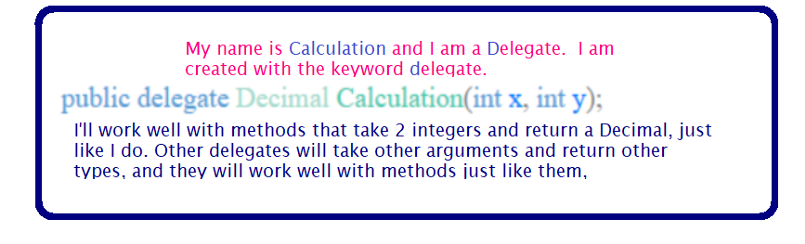
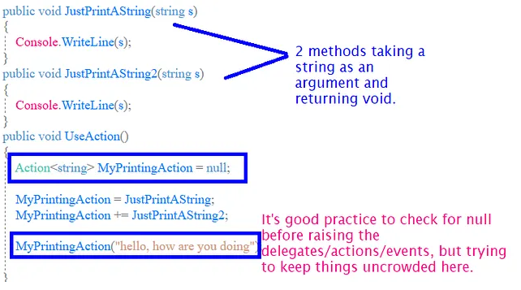
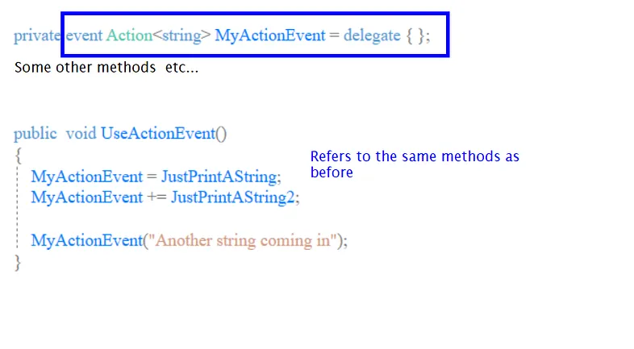
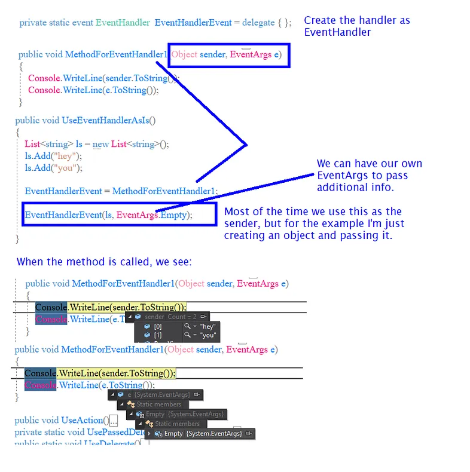
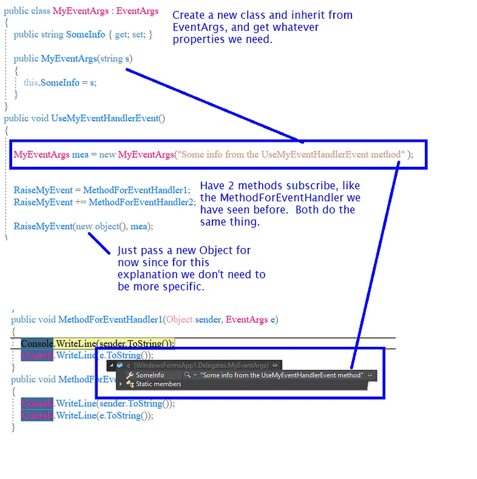
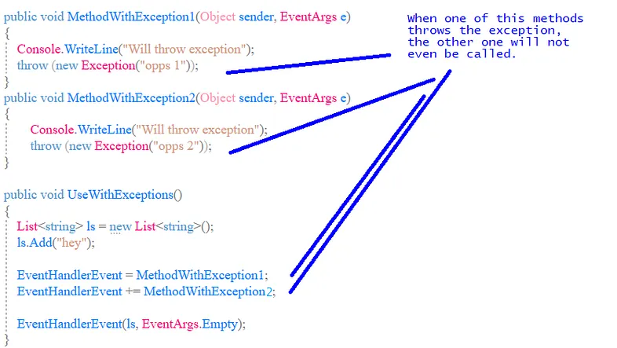
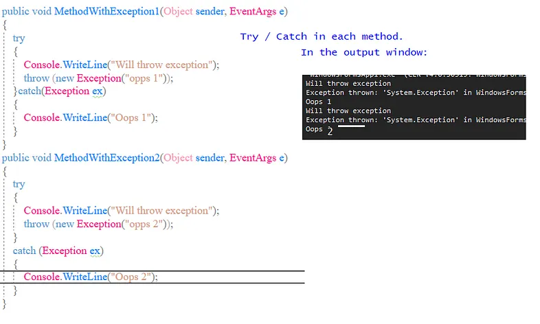
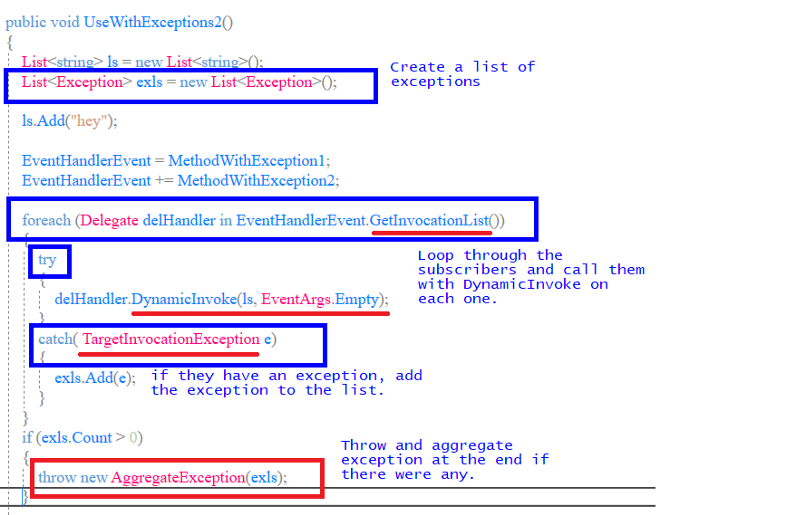

# Delegates, Actions, Events

## Regular Delegates

A delegate in C# is a type, that refers to methods with a specific parameter list and return type. Delegates are used to pass methods as arguments to other methods.



The delegate doesn’t care whether the methods are static or not so it will work well with both types.  We can set one or more methods to run with one delegate.

```
Decimal result = 0;
//Use the Calculation type of delegate (above image)
Calculation delegateCalcHandler = null;
var random = new Random();
int x = random.Next(1, 5);// random number 1-4
//class just to indicate we can use static or instance methods
SumSub sumSub = new SumSub();
//just to assigned some method at random
switch (x)
{
     case 1:
          delegateCalcHandler = sumSub.Sum;
          break;
     case 2:
          delegateCalcHandler = sumSub.Sub;
          break;
     case 3:
          delegateCalcHandler = Prod;
          break;
     case 4:
          delegateCalcHandler = Div;
          break;
     default:
          delegateCalcHandler = sumSub.Sum;
          break;
}
//call the delegate, which will call whatever method was assigned at random
//it doesn't matter as long as the parameters and return value match
result = delegateCalcHandler(3, 4);

```

If we wanted to call more than one method with the same delegate, we would replace the random assignment above with something like this.
```
//have the delegate handler call all the methods
delegateCalcHandler = sumSub.Sum;
delegateCalcHandler += sumSub.Sub;
delegateCalcHandler += Prod;
delegateCalcHandler += Div;
delegateCalcHandler(2, 1);//will call all the methods.
```

Methods are not guaranteed to be called in the order they were added to the delegate. Delegates are objects, so they can also be passed to other methods.

```
//pass the delegate to UsePassedDelegate
UsePassedDelegate(delegateCalcHandler);
private void UsePassedDelegate(Calculation calc)
{
     Decimal d = calc(3, 2);
}
```
Just like you can add methods to a delegate with the += notation, you can remove methods with -=.

## Actions

When the methods we are using are returning void we can use the Action type provided by C#. .NET provides a set of Action types, from Action with no arguments, to Action with 16 arguments (Action, Action<T1>, Action <T1, T2>…).  Actions can also be for static and instance methods.



The parameters used for actions can be anything, and they don’t have to all be the same type.

**When you create Action delegates in a class (I have it inside the method in my example), they are created as properties with set and get methods, so it’s possible for code outside the class to access them. You can add the event keyword to them and then they are created as fields instead of properties.**

## Func<>

similar to the Actions, you also have Funcs. Actions are used for when the methods return void, while with Funcs you will have a return value.  If you do this, the last one wins:

```
public string ReturnAdd(int x, int y)
{
   return (x + y).ToString();
}
public string ReturnMult(int x, int y)
{
   return (x * y).ToString();
}

//take 2 ints, return a string
Func<int, int, string> myFunc = ReturnMult;
myFunc += ReturnAdd;
Console.WriteLine(myFunc(3,3));
//the console will print 6, and if I change the order in which
//they are assigned, 9. Last one in wins
```
So that doesn’t make a lot of sense, so what’s the point? For starters a Func is a delegate object, not a method, so you can pass it around. You could have this, and it would work.

```
public void TakeAFunc( Func<int,int,string> arg)
{
   Console.WriteLine(" in TakeAFunc");
   Console.WriteLine(arg(3, 3));
}
Func<int, int, string> myFunc = ReturnMult;
TakeAFunc(myFunc);
```

You could also do something like this.

```Func<int, int, string>? myFunc = null;
var rand = new Random();
int i = rand.Next(0, 10);
if (i < 5)
{
   myFunc = delegate (int x, int y)
   {
      return ((x * 10) * (y * 10)).ToString();
   };
}
else
{
   myFunc = delegate (int x, int y)
   {
      return ((x + 10 + y).ToString());
   };
}
Console.WriteLine(myFunc(3,3));
```
Or even better
```
myFunc = (x, y) => { return ((x * 10) * (y * 10)).ToString(); };
...
myFunc = (x, y) => { return ((x + 10 + y).ToString()); };
```

## Actions with the event keyword

When you create the Actions as Events in a class, they are created as fields not properties with get and set properties. Also, they are assigned a delegate on creation, so there is no need to check for null before calling it.




## If you are going to use events, use EventHandler instead of event Action

It is better because it allows subscribers to be given data about the event.

If we are using EventHandlers, the methods we can use with them need to have the parameters (Object sender, EventArgs e).



We will probably need to pass some customized information to the methods, and we can do that by creating a class that inherits from EventArgs.

In this case, the event is created this way:

` private static event EventHandler<MyEventArgs> RaiseMyEvent=delegate{};` 



## Dealing With Exceptions

What happens if we have more than one subscriber and we are not handling exceptions?




We could take care of the problem this way:




If we don’t want to have the try-catch blocks in each method, we can also do this:


