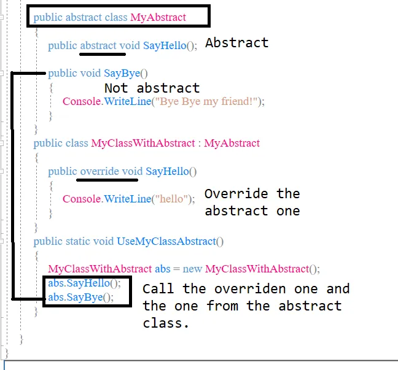
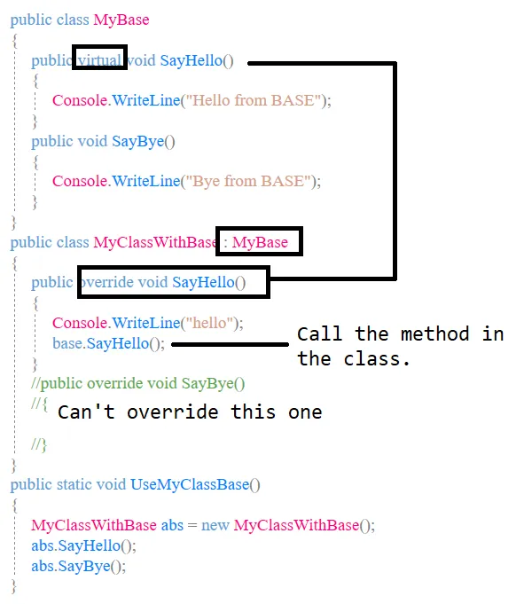

# Interfaces, Abstract Classes, Overriding

## Interfaces

An interface contains definitions for a group of related functionalities that a non-abstract class or a struct must implement. Beginning with C# 8.0, an interface may define a default implementation for members. An interface may not declare instance data such as fields, auto-implemented properties, or property-like events.

You can implement the C# interfaces in your own class, or you can also create an interface of your own.

If we create an interface like this:

```
interface MyInterface
{
   void SayHello();
   void SayGoodBye();
}
```

And we have a class that implements it:

```
public class MyClass : MyInterface
{
}
```

We will get a “class does not implement interface member” error if we don’t implement the 2 methods in the interface. The same will happen with any type of interface. So to use it:

```
public class MyClass : MyInterface
{
   public void SayGoodBye()
   {
      Console.WriteLine("Bye!");
   }
   public void SayHello()
   {
      Console.WriteLine("Hello!");
   }
}
public static void UseMyInterface()
{
   MyClass myc = new MyClass();
   myc.SayGoodBye();
}
```

## Abstract Classes

Abstract classes cannot be implemented. Abstract classes can contain abstract methods. They can be used as a base class for other classes.

If we try to create an instance of the abstract class, we will get an error that we cannot create an instance.

This is how you could use an abstract class:

```
public abstract class MyAbstract
{
   public abstract void SayHello();
   public abstract void SayBye();
}
public class MyClassWithAbstract : MyAbstract
{
   public override void SayHello()
   {
      Console.WriteLine("hello");
   }
   public override void SayBye()
   {
      Console.WriteLine("bye");
   }
}
public static void UseMyClassAbstract()
{
   MyClassWithAbstract abs = new MyClassWithAbstract();
   abs.SayHello();
}
```
Not all the methods in the abstract class have to be abstract. You can also have some implemented ones:



## Base Class — Not Abstract

As opposed to an abstract class, you can create an instance of a base class. Your base class can have methods that can be overriden (marked with virtual) and methods that cannot be overriden.

Trying to override a method that is not marked as virtual will give you a “cannot override inherited method because it is not marked virtual, abstract, or override”.




