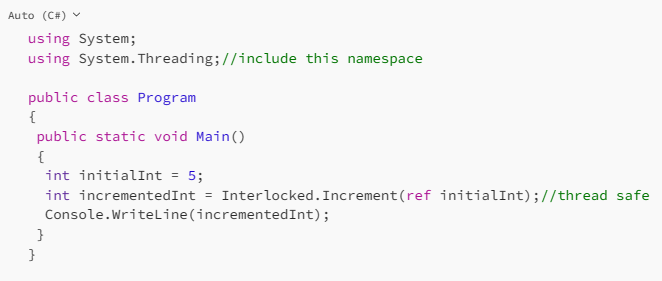

# Some little things that are simple but hard to remember, sometimes, for me at least

## Access Modifiers

private: Member is accessible only inside its type.

internal: Accessible inside the type and any type in the same assembly.

protected: Accessible inside the type, and types that inherit from it.

public: Accessible everywhere.

internal protected: Accessible inside the type, same assembly, and types that inherit from it.

private protected: Accesible inside the type, and any inherited type that is IN the same assembly.

## null coalescing operator

```
class Program {
   static void Main(string[] args) {
      string theString = "hello";
      string theOtherString = null;
      Console.WriteLine(theString ?? "Just Me"); //hello
      Console.WriteLine(theOtherString ?? "Just Me");//Just Me
   }
}
```
## operator overloading

```

public static SomeObj operator +(SomeObj o1, SomeObj o2)
{
   SomeObj newO = new SomeObj("");
   newO.TheThing = o1.TheThing + "-" + o2.TheThing;
   return newO;
}
//to use 
SomeObj obj1 = new SomeObj("hey");
SomeObj obj2 = new SomeObj("helloooo");
Console.WriteLine( (obj1 + obj2).TheThing);

```
## Ignore/use special chars

```
Console.WriteLine(@"blah blah \n \\hey ");//will print that same string

Console.WriteLine("Hello tab coming up \t see?"); //will print a tab after up

Console.WriteLine("c:\totals"); // prints c:      otals

Console.WriteLine("c:\\totals"); // prints c:\totals
```

## format strings with variables
```
string fillIt = "Michael";
Console.WriteLine($"My name is {fillIt}");
//the one below uses C so it will print with currency format:
decimal amount = 8.94m;
Console.WriteLine($"My amount is {amount:C}");//My amount is $8.94

int i = 10;
int j = 20;

Console.WriteLine( format: "Number i is {0} and number 2 is {1}", 	i,j);
//prints Number i is 10 and number 2 is 20

private const string _name = "Michael";
private const string _lname = "Jackson";
private const string _fullName =  $"{_name}{_lname}"; // in console it would be Michael Jackson.

Console.WriteLine(String.Format("The current price is {0} per ounce.", 100));

//the -10 and the 6 indicate the alignment of the argument.
//hardcoding the values here, instead of using variables for simplicity
Console.WriteLine(   format: "{0,-10} {1,6}",   arg0: "Name",   arg1: "Count");
Console.WriteLine(  format: "{0, -10} {1, 6:N0}",    arg0: "Bananas",    arg1: 5);
Console.WriteLine(  format: "{0, -10} {1, 6:N0}",   arg0: "Apples",   arg1: 12);
```
## Numbers

```
 int i = 10_123;
Console.WriteLine(i); //prints number 10123
 Console.WriteLine( $"Number is {i:C}");//prints $10,123.00

checked{
       //code that may result in an overflow, use the checked so we know if this happens, instead of it being ignored.
}
//Also have the checked code inside a try catch so we can do something if the exception happens
```

## Checked

```
using System;
					
public class Program
{
	public static void Main()
	{
		uint a = uint.MaxValue;
		
		Console.WriteLine("MaxValue : " + a); //prints 4294967295
		Console.WriteLine(a + 1); //prints 0
		
		unchecked
		{
    		Console.WriteLine(a + 1);  // prints : 0
		}
		
		try
		{
    		checked
    		{
        		Console.WriteLine(a + 1); //prints Arithmetic operation resulted in an overflow (in catch)
    		}
		}
		catch (OverflowException e)
		{
    		Console.WriteLine(e.Message);  // output: Arithmetic operation resulted in an overflow.
		}
		
		checked
    	{
        	Console.WriteLine(a + 1); //prints Unhandled exception. System.OverflowException....
    	}				
	}
}
```

https://dotnetfiddle.net/Lcwn9o

## params argument

```
class Program {    

   public static void SomeMethod(Int32 i, string s,  params string[] words){
      Console.WriteLine(i);
      Console.WriteLine(s);
      Console.WriteLine(words.Length);
   }
                    
   static void Main(string[] args) {
      SomeMethod(2, "hello",   "I","am","your","father");                  
   }
}

```

## passing parameters

```
using System;
					
public class Program
{
	public static void Main()
	{
		string first = "the A";
		string second = "the B";
		string third = "the C";
		
		SomeMethod1(first); 
		Console.WriteLine(first); // the A
		
		SomeMethod2(ref second);
		Console.WriteLine(second); // the B changed 2
		
		SomeMethod3(out third);//not passing it, getting the new value in it
		Console.WriteLine(third);//changed 3
				
	}
	
	public static void SomeMethod1(string s1){
		s1 += " changed 1 ";
	}
	public static void SomeMethod2(ref string s1){
		s1 += " changed 2 ";
	}
	public static void SomeMethod3(out string s1){
		s1 = "changed 3";
	}
	
}
```

https://dotnetfiddle.net/twbxEH

## Index Type

```

string[] arrays = new string[] {"zero", "one", "two", "three", "four", "five", "six"};
Console.WriteLine(arrays[4]); //prints four
Index i1 = new Index(3);
Console.WriteLine(arrays[i1]); // prints three
Index i2 = 1;
Console.WriteLine(arrays[i2]); // prints one
Index i3 = new Index(value:4, fromEnd:true);
Console.WriteLine(arrays[i3]); // prints three!!!!!!!!
Index i4 = new Index(value: 2, fromEnd: true);
Console.WriteLine(arrays[i4]); // prints five!!!!!!!!!!
Index i5 = ^2; //another way to say from the end.
Console.WriteLine(arrays[i5]); // prints five!!!!!!!!!!
```

## Ranges

```
Range r1 = new Range(start: new Index(2), end: new Index(4));
Range r2 = 1..3;
Range r3 = Range.StartAt(4);
Range r4 = 5..;
Range r5 = Range.EndAt(3);
Range r6 = ..3;

ReadOnlySpan<char> sp1 = "hello how are you?".AsSpan();
//start at zero but exclude the char at the end of the range
Console.WriteLine(sp1[1..2].ToString()); //e
Console.WriteLine(sp1[r1].ToString()); //ll
Console.WriteLine(sp1[r2].ToString());  //el
Console.WriteLine(sp1[r3].ToString()); //o how are you?
Console.WriteLine(sp1[r4].ToString()); // how are you?
Console.WriteLine(sp1[r5].ToString()); //hel
Console.WriteLine(sp1[r6].ToString());//hel
```

## Instantiate Structure

```
Test t1 = new();
Console.WriteLine(t1); //Test { defTrue = False, defFalse = False }

Test t2 = new Test(false);
Console.WriteLine(t2); //Test { defTrue = False, defFalse = False }

Test t3 = new Test(true);
 Console.WriteLine(t3); //Test { defTrue = True, defFalse = False }

Test? t4 = null;
var t5 = t4.GetValueOrDefault(default);
Console.WriteLine(t5); //Test { defTrue = False, defFalse = False }

Test t6 = new Test(false, true);
Console.WriteLine(t6); //Test { defTrue = False, defFalse = True }
```

## Discard

```
using System;

Test t = new Test();
Tuple<string,string> tp1 = t.SomeMethod();
Console.WriteLine(tp1.Item1 +  "-" +  tp1.Item2);
(_, string i2) = t.SomeMethod(); //disregard item1 and take only item2
Console.WriteLine(i2); 

public class Test{;
    public Tuple<string, string> SomeMethod()
    {   
         System.Tuple<string, string> t1 = new Tuple<string, string>("First", "Second"); 
          return t1; 
     } 
}
```

## Arrays
```
int[] intarray = { 1, 2, 3, 4, 5 };
string[] result = intarray.Select(x=>x.ToString()).ToArray();
```

## Enums

```
public enum SomeEnum{
   first,
   second,
   third
}
```

```
public enum SomeEnum{
   first = 11,
   second = 12,
   third = 13
}

SomeEnum e = SomeEnum.first;
Console.WriteLine((int)e); // will print 11.
```

```
 [System.Flags]
public enum SomeBinaryEnum:Byte{
   one = 0b0001,//1
   two = 0b0010,//2
   three = 0b0011//3
}

static void Main(string[] args) {
   SomeBinaryEnum e = SomeBinaryEnum.one;
   Console.WriteLine((Byte)e); //prints 1
   Console.WriteLine(e);  //prints One
}
```
But on the above enum, one and two together will give the same as 3, so if we want to use flags, we should choose values that don't overlap:

```
[System.Flags]
public enum SomeBinaryEnum:Byte{
   one = 0b0001,
   two = 0b0010,
   four = 0b0100
}

SomeBinaryEnum e = SomeBinaryEnum.one |   SomeBinaryEnum.two; //values 0b0001 and 0b0010 , or 0b0011 (3)
Console.WriteLine((Byte)e); // prints 3
Console.WriteLine(e); //prints one, two.
```

## function inside function

You can have a method and have a local function inside that method (starting with C#7). That local function can be accessed only from within that method. It could be something like int whateverMethod() function {... }


##find specific row in datagrid
```
int rowIndex = -1;

DataGridViewRow row = yourDatagrid.Rows
    .Cast<DataGridViewRow>()
    .Where(r => r.Cells["YourCol"].Value.ToString().Equals(searchValue))
    .First();

rowIndex = row.Index;

//or where (r=> Convert.ToBoolean(r.Cells["YourCol"].Value) == true
```

## About nulls and nullables

Starting with value types.


Add the `?` to make the value types nullable and now we can null them all.


Now for reference types.


Now we add #nullable enable (it can also be added to the project with <Nullable>enable</Nullable> (.NET 8)


Add `?` like in the value types and now we don’t get that warning anymore:


Of course if you want to use it, instantiate the class.


Use `??` to give an alternative value if the one you want to use is null.

```
using System;	
#nullable enable
public class Program
{
	public static void Main()
	{
		string theString = "hello";
      	string theOtherString = null;
      	Console.WriteLine(theString ?? "Just Me"); //hello
      	Console.WriteLine(theOtherString ?? "Just Me");//Just Me
	}	
}
```
Use `??=` to assign the variable to the new value only if it is null

```
using System;	
#nullable enable
public class Program
{
	public static void Main()
	{
		int? iamnull = null;
		int? iamNOTnull = 10;
		
		//use ??= to assing the value only if the variable is null
		iamnull??= 15;
		iamNOTnull??= 15;
		
		Console.WriteLine(iamnull); //15
		Console.WriteLine(iamNOTnull); //10
	}	
}
```

use `?` before accessing a property so it is not accessed if the class is null.

```
using System;	
#nullable enable
public class Program
{
	public static void Main()
	{
		Test t1 = new Test();
		Test t2 = new Test();
		Console.WriteLine(t1.name);
		t2 = null;
		Console.WriteLine(t2?.name); //use ? so the property is not accessed if t2 is null
	}	
	public class Test
	{
		public string name = "myname";		
	}
}
```

### Integers and Race Conditions

It doesn't look like it, but the ++and - -operators are not atomic, meaning, they could switch threads while in operation. Not likely because they are so fast, but just saying. You could use a lock statement to prevent this, but, that seems overkill for just an increment. Instead, Increment() and Decrement() which are thread safe.



### Window State
Windows forms have the resize event, which gets called not only on resizing but also when the window changes state (minimized, maximized) but by the time we get to it the state has already changed.

In that event we can keep track of the previous state by using a tuple: (previous, current) and on the Resize event, set the previous to whatever the current has, and the current to the window.WindowState.
Then when we need to restore the state we can
```
//do not change if not minimized because we could end up changing to minimize it
if (theform.WindowState == FormWindowState.Minimized)
{
	theForm.WindowState = theForm.thetuple.previous
}
theForm.Activate() //this will bring it to the front if it was not minimized but it was behind another screen
```

### Opening Window

Besides opening a window with ShowDialog and then making sure it is disposed of when closing, we can do this and it will dispose of itself when done.
```
using (SomeWindowType thewindow = new SomeWindowType())
{
	 var result = thewindow.ShowDialog();
	 if (result == DialogResult.OK) ....
 }
 ```
In the window that was opened, to pass the data back, in the appropriate events (Ok, cancel etc):

```
this.DialogResult = DialogResult.OK;
this.Close();

this.DialogResult = DialogResult.Cancel;
this.Close();
```

### ComboBoxes

You can populate the combobox by setting its DataSource to the list we need, or by doing 
```
thecombobox.Items.AddRange(thelist.ToArray())
```
If we set the data in the drop down with DataSource, we will not be able to add items to it at runtime.

You can also have the list be of a class with many properties and choose which property will be used as the display and as the value:
```
thecombobox.ValueMember = "Prop1";
thecombobox.DisplayMember = "Prop2";
```
Prop1 and Prop2 have to be properties in the class.  This will not work if those are just fields.

To get the value from the drop down:
```
TheObject = this.thecombobox.Items.Cast<TheObject>().FirstOrDefaut(x=> x that whatever)
```
To unselect the drop down use `thecombobox.SelectedItem=-1`
But that may not be enough if you had something already selected, you may also need
```
thecombobox.SelectedText = ""
thecombobox.Text = ""
```
Remember to clear the items before reloading.

## Exception ... When

When we want to handle the exception with more specification that what the exception type can provide
```
try
{
    //some code here
}
catch (Exception e) when (e.ErrorCode == 0x1234 || someVariableYouHave == "whatever")
{
    // Handle the *specific* error
}
```

## AppDomain.CurrentDomain.UnhandledException

This event is triggered when an exception is thrown in any thread of the application, and it's not caught by any try-catch block within the application.  You can use it as a notification
thing, not to recover from a specific exception.

This is how you could use it:

```
using System;

class Program
{
    static void Main(string[] args)
    {
        // Register the UnhandledException event with a handler method
        AppDomain.CurrentDomain.UnhandledException += new UnhandledExceptionEventHandler(MyHandlerMethod);
        
        throw new Exception("This exception is unhandled by the application code.");
    }

    // This method will be called when an unhandled exception occurs
    static void MyHandlerMethod(object sender, UnhandledExceptionEventArgs args)
    {
        Exception e = (Exception)args.ExceptionObject;
        Console.WriteLine("MyHandlerMethod caught : " + e.Message);
        //do something like log it somewhere or whatever you need to do, for notification, not to recover from it.
    }    
}
```
