# New! and not so new 

## C# 7.3

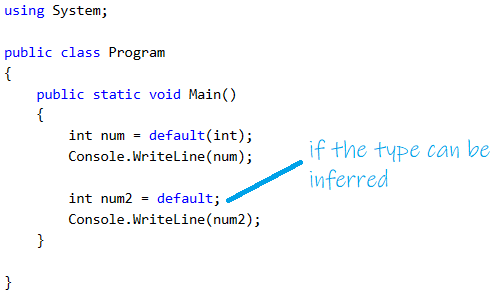

## C# 8

### Structures

Microsoft recommends using structures for immutable data (does not change). You can do this already by creating the structure as readonly. When you do that, the fields must also be read only and properties have to be read only or init. This is not new, the new part is coming up.

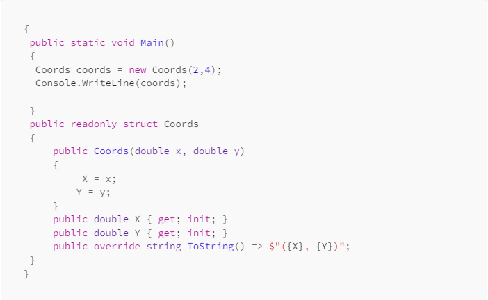

If the whole structure will not be read only, you can have some members be read only. This is the new part. You can use those read only members to make sure the structure will not be modified. Look at the difference between these two:
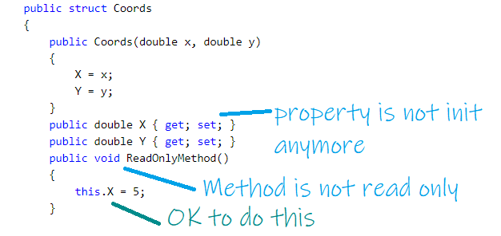

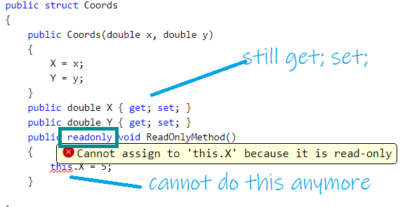

### Interfaces 

Interfaces can now provide an implementation for their methods; those are like default implementations.

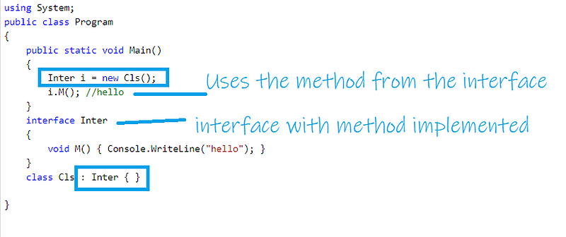

However

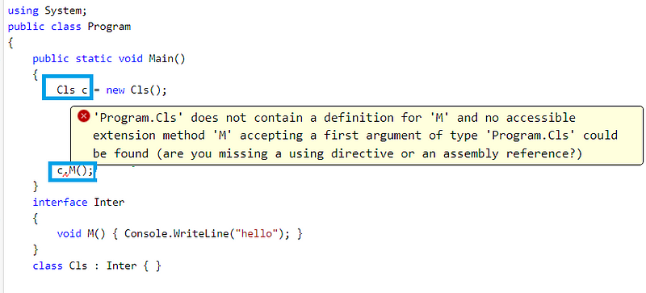

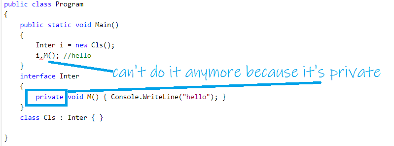

Pattern Matching enhancements were done, but please check that on the Pattern Matching article.

### using


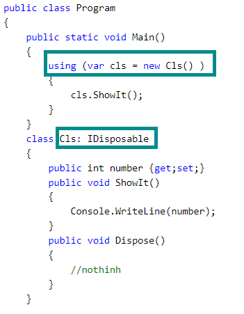

Starting with C#8, we can also have it as a using declaration.

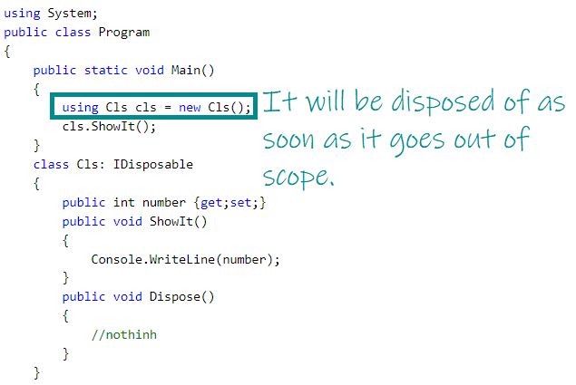

### STATIC local functions

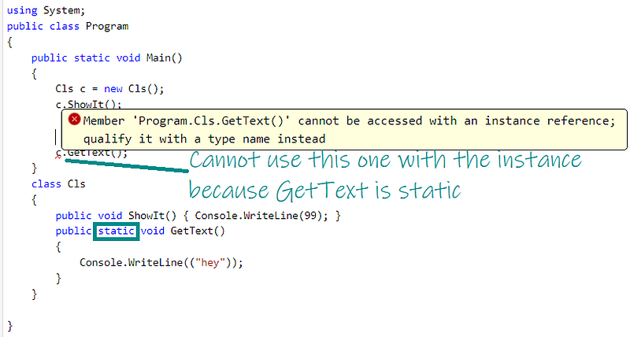

Instead:

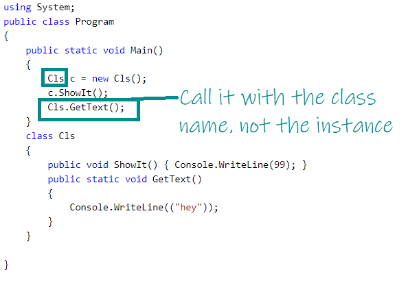

Nullable reference types were also added. But check the nullable or not nullable article for information on this.

### Range Operator ..

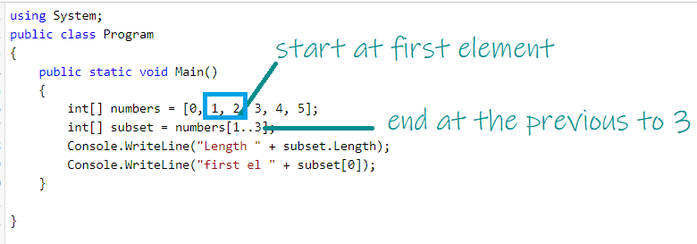

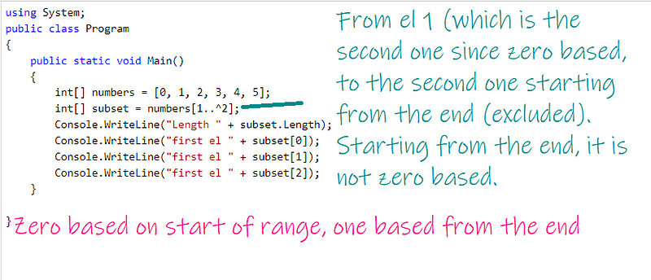

You don't have to provide both start and end, you could do this to get all of them:

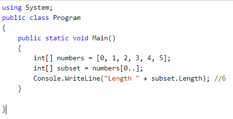


Nulls have changes, see little things article instead of this one

### index type

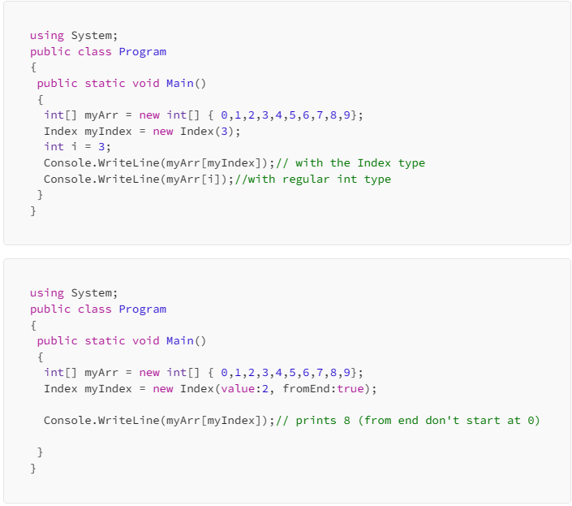


## C# 9

Records

A class OR struct that provides special syntax and behavior for working with data models.

Record Struct: Similar definition as the Record but when you want to specify that it’s going to be for a struct, not a class. (C#10)

Records give a little extra to classes and structures. If you are going to use them for a class, just use record instead of class, if you are going to use them for structures, use “record struct”. You can also do “record class” but it’s not necessary.

You can create them with IMMUTABLE properties like this:

```
public record Name( string first, string second );
//create with
Name name = new Name("Michael", "Jackson");
Console.WriteLine(name); //Name { first = Michael, second = Jackson }
```
You can also create them with MUTABLE properties:
```
public record Person
{
 public string FirstName { get; set; } = default!;
 public string LastName { get; set; } = default!;
}
```
Even though you can have records with mutable properties, the goal is to used them for immutable ones.

For records, when comparing, we are comparing values.
```
public record RecordName( string first, string second );
public class ClassName
{
   public string First { get; set; }
   public string Last { get; set; }
   public ClassName(string first, string last)
   {
      this.First = first;
      this.Last = last;
   }
}
...
RecordName recName1 = new RecordName("Michael", "Jackson");
RecordName recName2 = new RecordName("Michael", "Jackson");
ClassName className1 = new ClassName("Michael", "Jackson");
ClassName className2 = new ClassName("Michael", "Jackson");
Console.WriteLine(recName1.Equals(recName2));//True
Console.WriteLine(className1.Equals(className2));//False
```
A record can inherit from another record. A record can’t inherit from a class, and a class can’t inherit from a record (for record class types, not record struct ones).

```
public abstract record RecordName
{
   public string First { get; set; }
   public string Last { get; set; }
}
public record RecordNameDer : RecordName
{
   public string Middle { get; set; }
}
...
RecordNameDer name = new RecordNameDer  { First = "Michael", Last = "Jackson", Middle = "Joseph" };
//or could have also done
public abstract record RecordName(string First,string Last);
public record RecordNameDer(string First, string Last, string Middle) : RecordName(First, Last);
...
RecordNameDer name = new RecordNameDer ("Michael", "Jackson","Joseph" );
```
You can use positional syntax with records:
```
public record Person(string FirstName, string LastName);
public static void Main()
{
 Person person = new("Nancy", "Davolio");
 Console.WriteLine(person);
 // output: Person { FirstName = Nancy, LastName = Davolio }
}
```
For two record variables to be equal, the run-time type must be equal. This means if we have 2 different type records deriving from the same base, and having the same fields and values, they will still be different because their types are not the same.

You can create a new record based on another record:
```
Person person1 = new("Nancy", "Davolio") ;
Person person2 = person1 with { FirstName = "John" };
```
## Init only setters

You can create init accessors instead of set accessors for properties and indexers, Properties declared this way can only be assigned a value while construction is happening.
```
using System;

public class HelloWorld
{
    
    public static void Main(string[] args)
    {
        SomeClass sc = new SomeClass { s = "hello"};
        Console.WriteLine(sc.s);
        //sc.s = "hello again";  CANNOT do this
    }
}

public class SomeClass{
    public String s { get; init; }
}
```
## Top-level statements

Remove “unnecessary” code. For example, with the code above, we could just go directly to the code inside Main.

```
using System;

SomeClass sc = new SomeClass { s = "hello"};
Console.WriteLine(sc.s);


public class SomeClass{
    public String s { get; init; }
}
```
## Pattern matching enhancements

Just some examples:

```
using System;

Test t = new Test();
Console.WriteLine(t.TestMethod('!')); //FALSE
Console.WriteLine(t.TestMethod('A')); //TRUE


public class Test{
 
 public bool TestMethod(char c) =>
   c is (>= 'a' and <= 'z') or (>= 'A' and <= 'Z') or '.' or ',';
}
```

```
using System;

Test t = new Test();
Console.WriteLine(t.TestMethod('5')); //FALSE
Console.WriteLine(t.TestMethod(null)); //TRUE


public class Test{
 
 public bool TestMethod(char? c) =>
   c is null;
}
```
## Fit and finish features

You can omit the type in a new expression when the created object’s type is already known. private List _observations = new(); Same

Same thing when you are calling a method and because of the parameter type the compiler will know what type you are passing: SomeMethod(new());

Combine it with init only properties to initialize a new object: SomeType t = new() { Location = “Seattle, WA” } (SomeType has a Location property using init)

You can add the static modifier to lambda expressions or anonymous methods. Astatic lambda or anonymous method can’t capture local variables or instance state. The change was introduced to improve allocations.
```
using System;
using System.Collections.Generic;

const string text = "Country:{0}"; // could hardcode in the argument but just for the ex.

HelloCountry(static country => string.Format(text, country)); 
HelloCountry(country => string.Format(text, country)); 
HelloCountry(static country => string.Format("hello {0}", country)); 

void HelloCountry(Func<string, string> func)
{
    var countries = new List<string> { "France", "Spain" };

    foreach (var country in countries)
        Console.WriteLine(func(country));
}
```
You can use _ to discard things returned from a lambda expression or a method.

```
using System;

Test t = new Test();
Tuple<string,string> tp1 = t.SomeMethod();
Console.WriteLine(tp1.Item1 +  "-" +  tp1.Item2);
(_, string i2) = t.SomeMethod(); //disregard item1 and take only item2
Console.WriteLine(i2); 

public class Test{ 
 public Tuple<string, string> SomeMethod()
 {   
  System.Tuple<string, string> t1 = new Tuple<string, string>("First", "Second"); 
  return t1; 
 } 
}
```
You can also apply attributes to local function, for example you could add this to a local function: [Conditional("DEBUG")]

## C# 10

Beginning with C# 10, you can use string interpolation to initialize a constant string. All expressions used for placeholders must be constant strings.

You can add the global modifier to any using directive to instruct the compiler that the directive applies to all source files in the compilation.

You can declare a namespace like this namespace MyNamespace; to indicate everything following is part of the namespace.

You can reference nested properties or fields, what before would be { ParentProperty: { ChildProperty: Value } } now can be { ParentProperty.ChildProperty: Value }

In C# 10, you can add the sealed modifier when you override ToString in a record type.

You can declare the variable at the same it’s being assigned in a deconstruct: (x, int y) = point;

For diagnostics, you can use CallerArgumentExpression to get info from a specific method parameter. You can keep that info in the argument that uses this attribute and you can access it. public static void Validate(bool condition, [CallerArgumentExpression(“condition”)] string? message=null)

## C# 11

### Generic Attributes:

```
public class GenericAttribute<T> : Attribute { }

[GenericAttribute<string>()]
public string Method() => default;
```
Cannot use the GenericAttribute with a Generic type.

The text inside the { and } characters for a string interpolation can now span multiple lines.

Raw string literals are a new format for string literals. Raw string literals can contain arbitrary text, including whitespace, new lines, embedded quotes, and other special characters without requiring escape sequences. They start with 3 double quotes.

```
string longMessage = """
 This is a long message.
 It has several lines.
    I am indented, ha!
 Some have "quoted text" in them.
 """;
 ```
 Raw string literals can be combined with string interpolation to include braces in the output text. Multiple $ characters denote how many consecutive braces start and end the interpolation.

You can add the required modifier to properties and fields to enforce constructors and callers to initialize those values.

Beginning in C# 11, you can use the file access modifier to create a type whose visibility is scoped to the source file in which it is declared.

### List Patterns

```
//lists[0] = { 1, 2, 3, 4};
Console.WriteLine(lists[0] is [ >1, >2, <=3, 0]); //false
Console.WriteLine(lists[0] is [ 1, 2, <=3, >3]);//true


//lists2 = { 5, 6, 7, 8};
if (list2 is [var first, _, .. var others])
{
  Console.WriteLine(first); // 5
   //skip the second one with _
   string concatenated = string.Join(",", others);
   Console.WriteLine(concatenated); //7,8
}


string[] s = { "hello how are you" };
var text = s switch
{
      [] => "Name was empty",
      [var nocommasstring] => $"I have 1 el: {nocommasstring}",//prints this one
      [var first, var second, _] => $"I have with commas: {first} {second}",
   };
   Console.WriteLine(text);

string[] s2 = { "hello, how are you" };
var text2 = s2 switch
{
      [] => "Name was empty",
      [var oneel] => $"I have 1 el: {oneel}", //prints this one
      [var first, var second, _] => $"I have with commas: {first} {second}",
   };
   Console.WriteLine(text2);

string[] s3 =  { "hello" , "how are you" };
var text3 = s3 switch
{
      [] => "Name was empty", //will print if empty array
      [var oneel] => $"I have 1 el: {oneel}",
      [var first, var second] => $"I have with commas: {first} AND {second}",//prints this one
   };
   Console.WriteLine(text3);

string[] s4 =  { "hello" , "how are you" };
var text4 = s4 switch
{     //will give exception
      [var first, var second, var third] => $"I have with commas: {first} AND {second}",
   };
   Console.WriteLine(text4);


string[] s5 =  { "hello" , "how are you" , "I ask"};
var text5 = s5 switch
{     //will give exception
      [var first, var second] => $"I have with commas: {first} AND {second}",
   };
   Console.WriteLine(text5);

string[] s6 =  { "hello" , "how are you" , "I ask"};
var text6 = s6 switch
{     //use ..var second to avoid exception
      //prints I have with commas: hello AND how are you I ask
      [var first, ..var second] => $"I have with commas: {first} AND { string.Join(" ", second)}",
   };
   Console.WriteLine(text6);
   ```
   
## C#12

### Primary Constructors

Primary constructor parameters are in scope for the entire body of the class. To ensure that all primary constructor parameters are definitely assigned, all explicitly declared constructors must call the primary constructor using this() syntax. Adding a primary constructor to a class prevents the compiler from declaring an implicit parameterless constructor. In a struct, the implicit parameterless constructor initializes all fields, including primary constructor parameters to the 0-bit pattern.
Primary constructor parameters aren't members of the class. Primary constructor parameters don't become properties, except in record types.


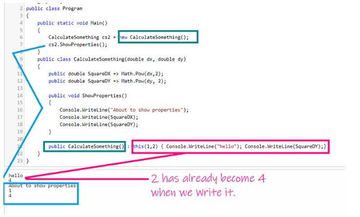

### Collection Expressions

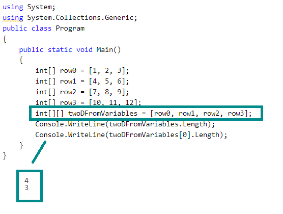

The spread operator, .. in a collection expression replaces its argument with the elements from that collection.

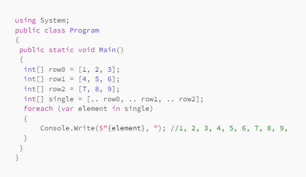

### Default Values for Lambda Expressions

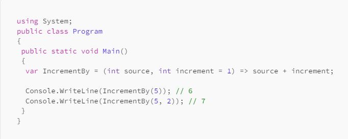

